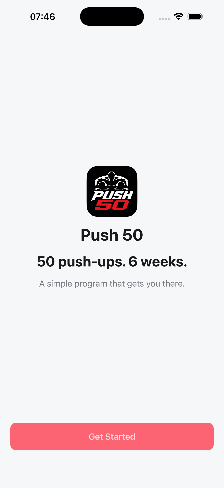
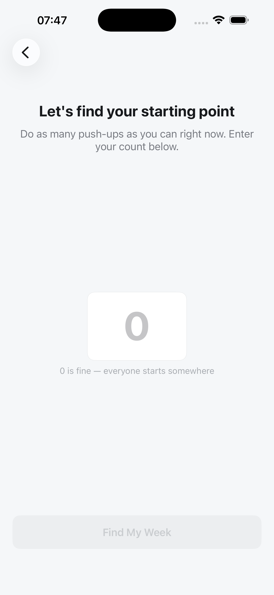
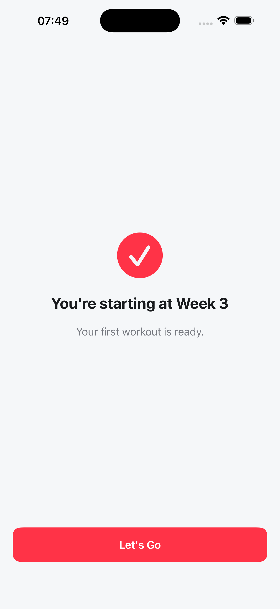
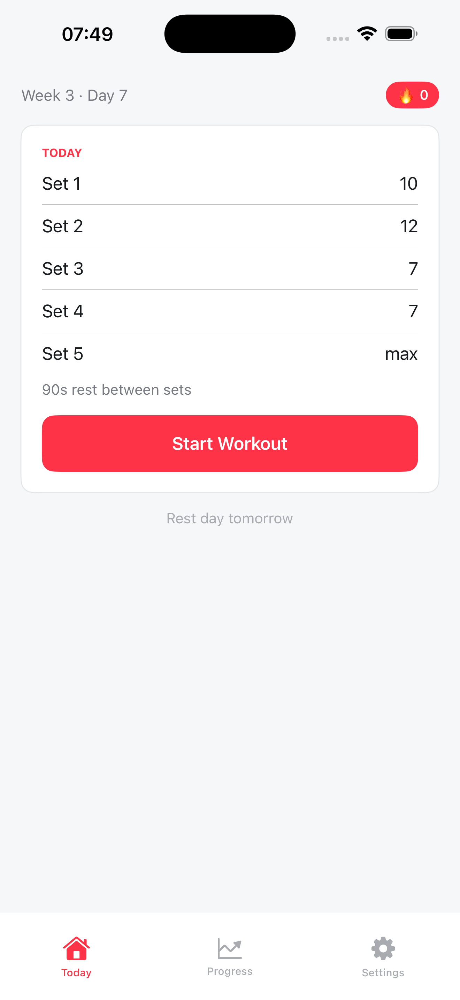
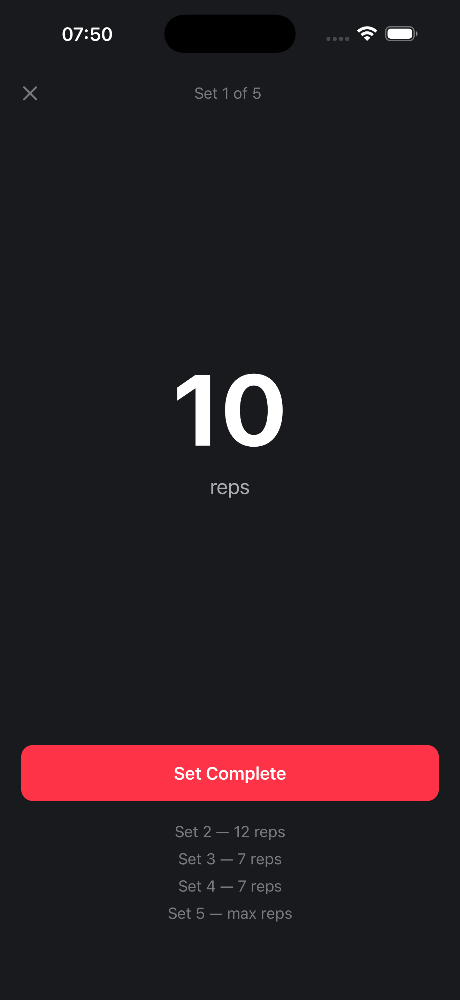
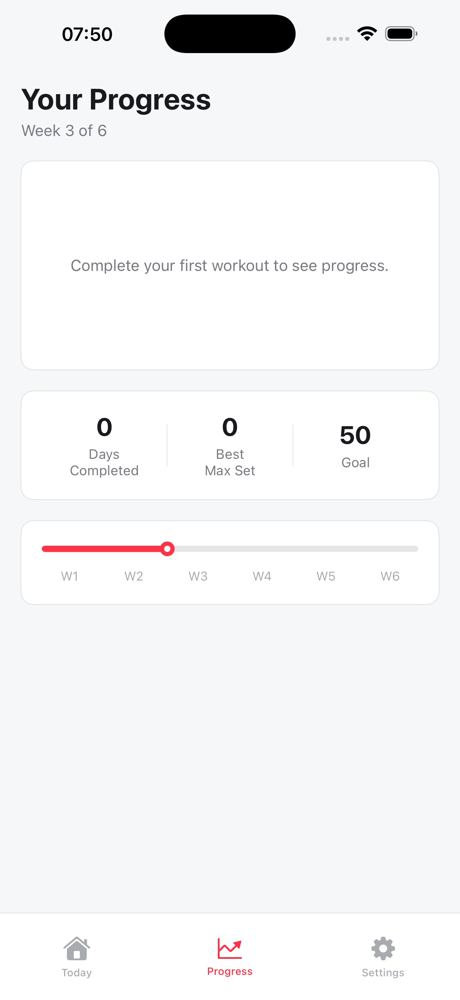

# Push 50

**50 push-ups. 6 weeks. A simple program that gets you there.**

Push 50 is an iOS app that guides users from wherever they're starting to 50 consecutive push-ups through a structured 6-week training program. No account required, no ads, no fluff.

## Screenshots

<table>
  <tr>
    <td align="center"><br/><sub>Onboarding</sub></td>
    <td align="center"><br/><sub>Placement Test</sub></td>
    <td align="center"><br/><sub>Starting Week</sub></td>
  </tr>
  <tr>
    <td align="center"><br/><sub>Today's Workout</sub></td>
    <td align="center"><br/><sub>Active Workout</sub></td>
    <td align="center"><br/><sub>Progress</sub></td>
  </tr>
</table>

## How It Works

1. **Placement test** — do as many push-ups as you can right now; the app places you in the right week (1–5) so you're never under- or over-challenged.
2. **Three workouts per week** — each session is 5 sets. Sets 1–4 have fixed rep targets; Set 5 is always "max reps."
3. **Progressive rest** — rest between sets increases from 60 s in Week 1 to 120 s in Week 6, keeping each session challenging as volume grows.
4. **Streak tracking** — a streak badge keeps you accountable day to day.
5. **Optional daily reminder** — a scheduled notification nudges you to train.

## Program Structure

| Week | Sample Day (Day 1) | Rest |
|------|-------------------|------|
| 1 | 5 · 5 · 4 · 4 · max | 60 s |
| 2 | 6 · 8 · 6 · 6 · max | 75 s |
| 3 | 10 · 12 · 7 · 7 · max | 90 s |
| 4 | 10 · 12 · 7 · 7 · max | 90 s |
| 5 | 14 · 16 · 12 · 12 · max | 105 s |
| 6 | 17 · 19 · 15 · 15 · max | 120 s |

18 workouts total (3/week × 6 weeks).

## Tech Stack

- **SwiftUI** — all views
- **SwiftData** — persists `AppState` (current week/day, streak, reminder prefs) and `WorkoutSession` history
- **No third-party dependencies**

## Project Structure

```
Push50/
├── App/
│   ├── Push50App.swift          # @main, modelContainer setup
│   ├── RootView.swift           # Routes between onboarding and main tabs
│   ├── MainTabView.swift        # Today / Progress / Settings tab bar
│   └── AppStateBootstrapper.swift
├── Models/
│   ├── AppState.swift           # SwiftData model — program position, streak, prefs
│   ├── ProgramSchedule.swift    # All 18 workout days; placement → starting week logic
│   └── WorkoutSession.swift     # Completed session record
├── Features/
│   ├── Onboarding/              # Welcome screen
│   ├── PlacementTest/           # Rep-count input → starting week assignment
│   ├── Home/                    # Today tab — current workout card
│   ├── Workout/                 # Full-screen active workout (set-by-set flow)
│   ├── Progress/                # Days completed, best max set, W1–W6 timeline
│   └── Settings/                # Daily reminder toggle, reset, about
├── Components/                  # Shared UI: PrimaryButton, CardView, StreakBadge, BottomNavBar
└── Design/
    └── DS.swift                 # Design system tokens (colors, spacing, typography)
```

## Building

Open `Push50.xcodeproj` in Xcode 15+, select a simulator or device running iOS 17+, and run. No additional setup required.
